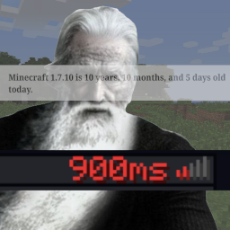

# Older Ping Display
A simple client-side mod which displays each player's ping in the player list as a number.
`1.7.10` backport of [Better Ping Display](https://github.com/vladmarica/better-ping-display-fabric).

The mod is highly configurable and has a neat GUI config thanks to `Carbon Config`.

## Downloads
* [CurseForge ](https://www.curseforge.com/minecraft/mc-mods/olderpingdisplay)
* [Modrinth ](https://modrinth.com/mod/olderpingdisplay)
* [Git ](https://github.com/JackOfNoneTrades/OlderPingDisplay/releases)

## Dependencies
* [UniMixins](https://modrinth.com/mod/unimixins) (, , ) is a required dependency.
* Prior to version 1.0.0, [CarbonConfig](https://modrinth.com/mod/carbon-config) (, , ) is a required dependency.

## Building

`./gradlew build`.

## Credits
* [Original mod](https://github.com/vladmarica/better-ping-display-fabric)
* [NumericalTabPing](https://github.com/Nixuge/NumericalTabPing)
* [GT:NH buildscript](https://github.com/GTNewHorizons/ExampleMod1.7.10)

## License

`LgplV3 + SNEED`.

## Buy me a coffee

* [ko-fi.com](ko-fi.com/jackisasubtlejoke)
* Monero: `893tQ56jWt7czBsqAGPq8J5BDnYVCg2tvKpvwTcMY1LS79iDabopdxoUzNLEZtRTH4ewAcKLJ4DM4V41fvrJGHgeKArxwmJ`

 

