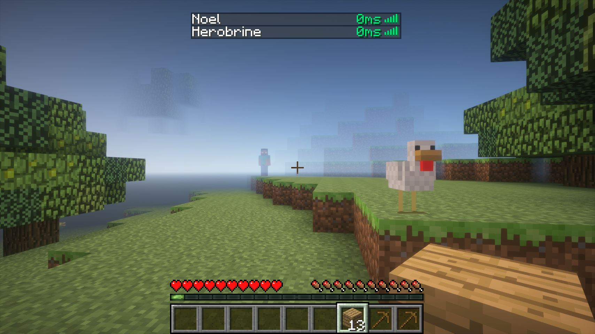
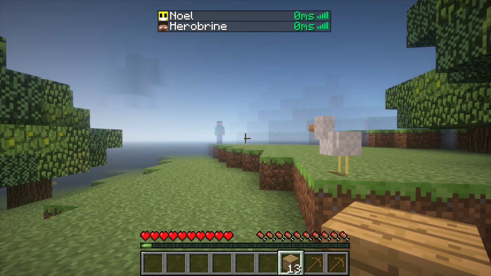

# Older Ping Display
A simple client-side mod which displays each player's ping in the player list as a number. The mod is highly configurable.
`1.7.10` backport of [Better Ping Display](https://github.com/vladmarica/better-ping-display-fabric).

## Dependencies
* [UniMixins](https://modrinth.com/mod/unimixins)   

Compatible with TabFaces   .

## Building

`./gradlew build`.

## Credits
* [Original mod](https://github.com/vladmarica/better-ping-display-fabric)
* [NumericalTabPing](https://github.com/Nixuge/NumericalTabPing)
* [GT:NH buildscript](https://github.com/GTNewHorizons/ExampleMod1.7.10)

## License

`LgplV3 + SNEED`.

## Buy me a coffee

* [ko-fi.com](ko-fi.com/jackisasubtlejoke)
* Monero: `893tQ56jWt7czBsqAGPq8J5BDnYVCg2tvKpvwTcMY1LS79iDabopdxoUzNLEZtRTH4ewAcKLJ4DM4V41fvrJGHgeKArxwmJ`

 

